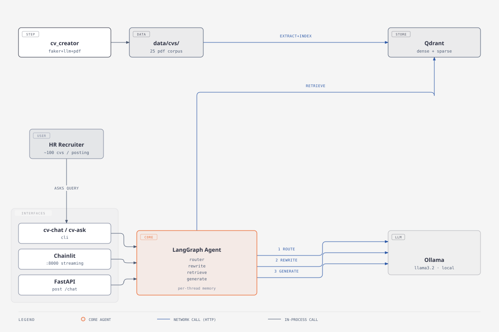

# Hirebrain

An agentic RAG project built on a real document corpus, not a toy demo. Hirebrain creates a
synthetic corpus of candidate CVs as PDFs, indexes it with hybrid dense and sparse retrieval,
and answers screening questions through a LangGraph agent. The agent decides the intent,
rewrites the query, retrieves evidence, and generates an answer that is grounded in the actual
CV text.



## What this project shows

- **Hybrid retrieval.** Dense search (sentence-transformers) plus sparse search (BM25) over
  Qdrant, with a reranker to narrow down to the best matches.
- **An agent, not just a prompt.** A LangGraph graph classifies the intent (profile, lexical, or
  hybrid), rewrites the query for retrieval, then generates the answer. Each step can be tested
  and swapped on its own.
- **Grounded answers.** Every answer cites the CV chunks it came from. If a question is out of
  scope, the router rejects it instead of making something up.
- **A synthetic data factory.** `cv_creator` builds a full PDF corpus (a Faker skeleton, LLM
  enrichment, then Jinja2 and WeasyPrint rendering), so the RAG pipeline has real documents to
  work with instead of hand-written test files.
- **Three ways to use it.** A CLI, a Chainlit web UI with streaming, and a FastAPI `POST /chat`
  endpoint, all talking to the same agent.

## Setup (Ollama already running on `localhost:11434`)

```bash
# 1. Install deps
uv sync --extra rag --extra ui --extra dev

# 2. Config
cp .env.template .env

# 3. Vector store (Qdrant only, Ollama runs natively)
docker compose up -d qdrant
curl http://127.0.0.1:6333/readyz    # ready check
```

## Run

```bash
uv run cv-creator -n 10 --seed 42                          # generate CVs -> data/cvs/
uv run cv-extract --input-dir data/cvs --export-chunks-dir  # extract + chunk
uv run cv-index                                             # index into Qdrant

uv run cv-chat "Summarize the profile of Timothy Thompson" --thread-id demo --verbose
uv run cv-ask "Who has experience with Python?"             # retrieval only, no agent

uvicorn rag.api.app:app --reload                             # REST API on :8000
chainlit run src/rag/frontend/chainlit_app.py -w             # web UI on :8000
```

## Tests

```bash
uv run pytest
```

## Learn more

[`docs/scale.md`](docs/scale.md) explains how this could grow from a local demo into a tool
an HR recruiter uses for real, screening about 100 CVs per job posting, and what would need to
change at that scale.
