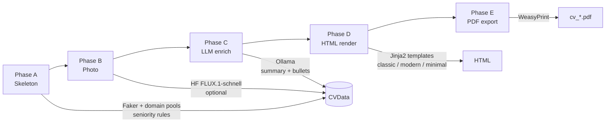

# `cv_creator` module

Synthetic CV generator for the **RAG-powered CV Screener** project. It produces realistic, English-language résumés as PDF files so the downstream RAG pipeline (`cv-extract` → `cv-index` → agent) has a corpus to search over—without relying on real candidate data.

The design follows a **deterministic skeleton + LLM enrichment** pattern: structured facts (names, dates, titles, skills) are generated with rules and random seeds; narrative content (summary and job descriptions) is written by a local LLM via Ollama.

---

## Pipeline overview



| Phase | Responsibility | Output |
| ----- | -------------- | ------ |
| **A — Skeleton** | Pick domain, career arc, education, skills, contact info | `CVData` with empty descriptions |
| **B — Photo** | Generate a corporate headshot (cached by candidate slug) | `photo_path` on `CVData` |
| **C — LLM** | Write professional summary and experience bullets in English | Enriched `CVData` |
| **D — Render** | Apply HTML/CSS template | Printable HTML string |
| **E — Export** | Convert HTML to PDF | `data/cvs/cv_{slug}.pdf` |

---

## What makes a “good” synthetic CV?

The skeleton generator encodes several HR-realistic constraints:

- **Domain-aware profiles** — Software Engineering, Data Science, HR, Finance, or Sales, each with matching job titles and skills.
- **Ascending career arc** — 2–4 roles in reverse chronological order; seniority increases over time (junior → senior → manager/director).
- **Coherent timelines** — Education ends before the first job; roles do not overlap; optional internal promotions (~20% chance at the same company).
- **Reproducibility** — A fixed `--seed` yields the same candidate structure (names, dates, titles).

The LLM step only rewrites **summary** and **experience descriptions**. Job titles, companies, skills, and dates stay fixed so retrieval metadata remains stable and grounded.

---

## Project structure

```
src/cv_creator/
├── core/                 # Domain models, paths, exceptions
│   ├── models.py         # CVData, PipelineConfig, …
│   └── paths.py          # DEFAULT_CVS_DIR, photo cache, RAG artifact paths
├── generators/           # Phase A — deterministic skeleton
│   ├── skeleton.py       # build_candidate_skeleton()
│   ├── pools.py          # Domains, companies, degrees, seniority levels
│   └── seniority.py      # Career-arc rules
├── integration/          # Phases B & C — external services
│   ├── photo_service.py  # Hugging Face text-to-image (FLUX)
│   └── llm_service.py    # Ollama JSON enrichment
├── rendering/            # Phases D & E — HTML → PDF
│   ├── renderer.py       # Jinja2 + theme CSS
│   ├── pdf_exporter.py   # WeasyPrint
│   └── templates/        # classic, modern, minimal layouts
├── cli/
│   └── main.py           # `cv-creator` entry point
└── pipeline.py           # run_pipeline(), generate_cvs()
```

---

## Quick start

From the repository root (after `uv sync`):

```bash
# Start Ollama (required for LLM enrichment)
docker compose up -d

# Generate 10 CVs with a fixed seed
uv run cv-creator -n 10 --seed 42
```

PDFs are written to `data/cvs/` by default (e.g. `cv_timothy_thompson.pdf`).

### CLI options

| Flag | Description |
| ---- | ----------- |
| `-n`, `--count` | Number of CVs to generate (default: `1`) |
| `-o`, `--output` | Output directory (default: `data/cvs` or `CV_OUTPUT_DIR`) |
| `--seed` | Random seed for reproducible batches |
| `--model` | Ollama model (default: `llama3:8b`) |
| `--host` | Ollama host URL (default: `OLLAMA_HOST`) |
| `--template` | Layout: `classic`, `modern`, or `minimal`. If omitted, templates rotate per CV |

---

## Configuration

Environment variables (see root `.env.template`):

```bash
# LLM (Ollama)
OLLAMA_MODEL=llama3:8b
OLLAMA_HOST=http://127.0.0.1:11434

# Output
CV_OUTPUT_DIR=data/cvs

# Profile photos (optional; skipped if HF_TOKEN is missing and fail_on_error=false)
HF_TOKEN=
HF_PHOTO_ENABLED=true
HF_PHOTO_FAIL_ON_ERROR=false
HF_PHOTO_MODEL_ID=black-forest-labs/FLUX.1-schnell
HF_PHOTO_CACHE_DIR=.cache/photos
```

Photo generation uses the Hugging Face Inference API. When disabled or when generation fails (and `HF_PHOTO_FAIL_ON_ERROR=false`), the pipeline continues without a profile picture.

---

## Programmatic usage

```python
from cv_creator.core.models import PipelineConfig, GenerationConfig, LLMConfig
from cv_creator.pipeline import generate_cvs

results = generate_cvs(
    count=3,
    config=PipelineConfig(
        generation=GenerationConfig(seed=42),
        llm=LLMConfig(model="llama3:8b"),
        output_dir="data/cvs",
    ),
    base_seed=42,
)

for r in results:
    print(r.cv_data.full_name, "→", r.pdf_path)
```

---

## Templates

Three printable layouts ship with the module:

| Template | Style |
| -------- | ----- |
| `classic` | Traditional single-column résumé |
| `modern` | Two-column layout with accent styling |
| `minimal` | Clean, typography-focused design |

Each template pairs an HTML file with a theme CSS file under `rendering/templates/`. Photos are embedded as data URIs so WeasyPrint resolves assets reliably.

---

## Role in the wider system

`cv_creator` is the **data factory** for the screener:

```
cv-creator  →  data/cvs/*.pdf
     ↓
cv-extract  →  artifacts/rag/chunks/
     ↓
cv-index    →  Qdrant collection
     ↓
cv-chat / Chainlit / API  →  answers with cited evidence
```

Shared path constants live in `cv_creator.core.paths` and are reused by the RAG ingestion CLI.

---

## Tests

Relevant tests live under `tests/` at the repository root:

```bash
uv run pytest tests/test_seniority.py tests/test_pipeline_e2e.py tests/test_photo_service.py tests/test_models.py -q
```
