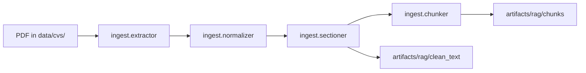

# `src/rag` module

RAG pipeline for CV screening: **ingestion** (PDF → chunks), **retrieval** (hybrid, pending), **agent** (LangGraph, pending), and **api** (FastAPI, pending).

CLI: **`cv-extract`** → `rag.cli.main:main` ([`cli/main.py`](cli/main.py)).

---

## Structure

```
src/rag/
├── ingest/           # PDF → sections → chunks
│   ├── extractor.py
│   ├── normalizer.py
│   ├── sectioner.py
│   ├── chunker.py
│   ├── pipeline.py
│   └── paths.py
├── retrieval/        # Vector store, BM25, hybrid, reranker (stubs)
├── agent/            # LangGraph: state, nodes, graph (stubs)
├── api/              # FastAPI for frontend (stubs)
├── shared/           # Shared models and config
│   ├── models.py
│   ├── settings.py
│   └── schemas.py
└── cli/              # cv-extract entrypoint
    └── main.py
```

---

## Ingestion flow (implemented)



Orchestration: [`ingest/pipeline.py`](ingest/pipeline.py) (`run_extraction`, `run_batch`, JSON/txt export).

---

## Programmatic usage

```python
from pathlib import Path
from rag.ingest.pipeline import run_extraction, export_chunk_files
from rag.ingest.chunker import CVChunker
from rag.shared.models import CVChunk

result = run_extraction(Path("data/cvs/cv_ejemplo.pdf"))
```

Retrieval as an agent node (future):

```python
# rag.agent.nodes.retrieve_node will call rag.retrieval.hybrid_search.search(...)
```

---

## Recommended imports

| Need | Module |
|------|--------|
| Orchestration / export | `rag.ingest.pipeline` |
| Chunking | `rag.ingest.chunker` |
| Models | `rag.shared.models` |
| PDF extraction | `rag.ingest.extractor` |
| PDF paths | `rag.ingest.paths` |
| CLI | `rag.cli.main` |

---

## Pending modules

| Module | Expected contract |
|--------|-------------------|
| `retrieval.hybrid_search` | `search(query, filters=..., top_k=10)` |
| `retrieval.reranker` | `rerank(query, candidates)` |
| `agent.graph` | `build_graph()` → LangGraph graph |
| `api.app` | `create_app()` → FastAPI |

---

## Artifacts

| Path | Content |
|------|---------|
| `artifacts/rag/clean_text/{doc_id}.txt` | Sections `=== NAME ===` |
| `artifacts/rag/chunks/{doc_id}.chunks.json` | Chunks + metadata |

Environment variables: `RAG_CLEAN_TEXT_DIR`, `RAG_CHUNKS_DIR` (see `cv_creator.core.paths`).

---

## Tests and strategy

- Tests: `tests/test_chunking.py`, `tests/test_rag_pipeline_export.py`, `tests/test_pdf_paths.py`
- Product strategy: [`docs/estrategia-rag.md`](../../docs/estrategia-rag.md)
